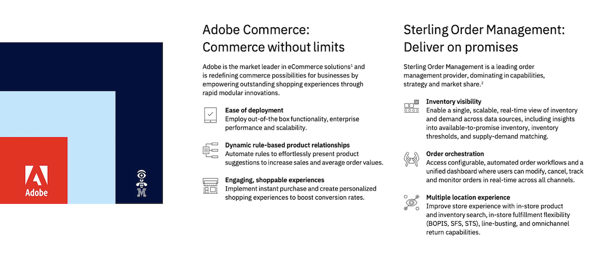
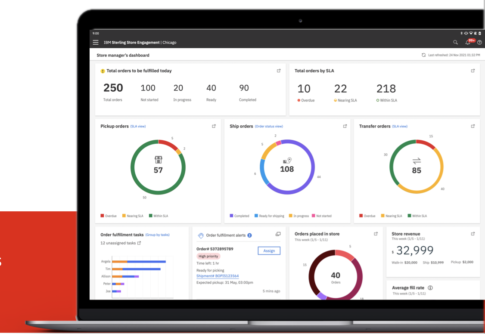
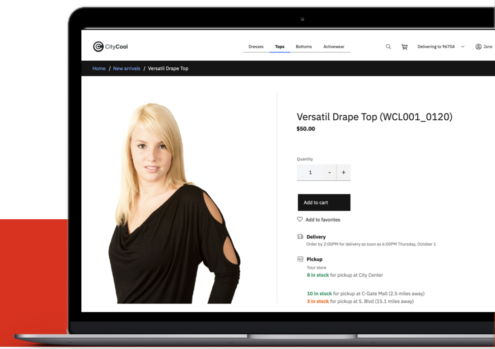
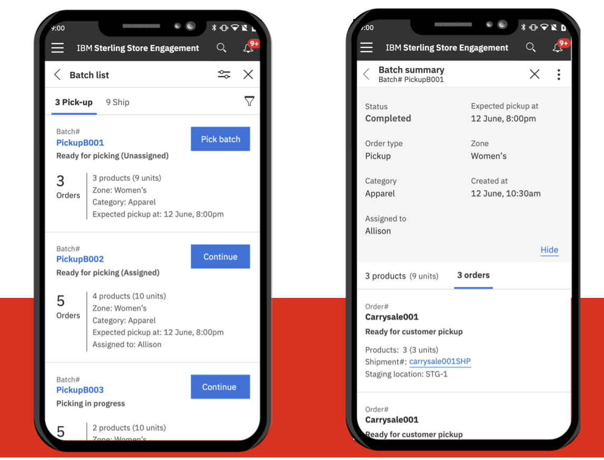

# [!DNL Adobe Commerce Order Management powered by IBM Sterling] High level benefits
>[!NOTE]
>
> Adobe Commerce Order Management powered by IBM Sterling is currently in the Beta Phase; please contact your Sales / CSM contact for more information.

Adobe Commerce Order Management powered by IBM Sterling empowers merchants to fulfill their order management needs with the ability to grow and mature quickly over time. The integration is built and designed by Adobe & IBM and architected using the latest extensibility best practices, including App Builder as the central extensibility layer that will allow SIs to complete the integration without customizing the core commerce platform. IBM Sterling is the leading OMS, which offers the richest set of capabilities but is also very complex and requires ongoing investment. A connector powers the integration maintained/developed by Adobe/IBM, which reduces TCO significantly, and new features and use cases are added through a product roadmap that Adobe manages. That embedded solution [!DNL Adobe Commerce Order Management powered by IBM Sterling] contains content relevant for Adobe Commerce Merchant & Solution partners:

## Value Statements & high level scope

* For a merchant’s **system integrator**, Adobe Commerce Order Management powered by IBM Sterling offers pre-built connectors to simplify integration and accelerate time to value.

* For a merchant’s **commerce management team**, Adobe Commerce Order Management powered by IBM Sterling delivers foundational order management capabilities, with the ability to easily grow and mature over time.

* For a merchant’s **online shoppers**, Adobe Commerce Order Management powered by IBM Sterling provides an enhanced omnichannel experience, including real-time product availability and multiple fulfillment options.

* For a merchant’s **shopper support staff**, Adobe Commerce Order Management powered by IBM Sterling provides tools for omnichannel support, including advanced order status visibility and support for in-store fulfillment of online orders.

## System Integrators

For technical integration details please go hover the technical overview.

* **Single integration layer for both Adobe Commerce and IBM Sterling**: A centralized extensibility mechanism in an App Builder allows system integration to manage the whole integration required connections between the systems (Adobe/IBM) and outside (ERP, WMS, etc) from a single point that is decoupled from Adobe Commerce & IBM Sterling and with the same technology stack. That extensibility approach will reduce TCO as SIs can release changes without requiring changes for Adobe Commerce and/or IBM Sterling.
* **Pre-integration for most common eCommerce flows between the 2 systems**:The App Builder & Adobe IO technology enables robust event-based synchronization between the two systems. The most critical data objects (inventory, order, shipments, returns) synchronization is managed in an external technology stack, which ensure scalability in the storefront is not impacted.
* **Templated integration for IBM Sterling with 3rd party**: The App Builder application will provide System Integration pre-defined templates to deliver last-mile integrations with the most common 3rd party systems (DC, Carrier, POS) required for a robust OMS integration without adding any Java line of code in IBM Sterling.
* **Faster onboarding to realize the integration**: During the project, Adobe and IBM built a complete pre-configuration and standard template workflows, considering Adobe Commerce and IBM Sterling's best practices, which will drastically reduce the time for starting merchant integration.

## E-commerce managers

* **Automatic sourcing mechanism**:  Pre-configured set of automatic rules that will handle automatically the sourcing in the desired scheduling decided by the merchant. The commerce management team will get access to a set of dashboards to control any delay/exception during sourcing calculation to organize replenishment or manually define a desired sourcing.
* **Stock accuracys**: Pre-integrate an inventory synchronization mechanism and a set of dashboards to ensure better accuracy in stock handling in Adobe Commerce.
* **Order Approval/hold process**: Set of monitoring dashboards in order to understand the fulfillment performance and act against any exception in the system.
* **Fulfillment performance/fulfillment exception manage**: During the project, Adobe and IBM built a complete pre-configuration and standard template workflows, considering Adobe Commerce and IBM Sterling's best practices, which will drastically reduce the time for starting merchant integration.
* **Long backorders / pre-sales**: Set of monitoring dashboards in order to understand the fulfillment performance and act against any exception in the system.

## Online Shoppers

* **Estimated delivery time**:  More granular and transparent visibility about promised delivery for each one of the items once they add them to the cart.
* **Enrich buy online & pickup in store**: Pre-integrated and granular stock visibility at the physical store level for shoppers is able to compare their preferred pickup location. Include the capacity of initiate ISPU from PDP.
* **Avoid overselling**: Automatic stock alert shopper about stock inaccuracy during checkout, check will happen before order placement for IBM sterling is able to allocate the stock before hand.

## Shopper support staff

* **Buy online & pick up in store**:  Tool to manage to pick/pack/collect processes to complete in an optimized way a Buy & pickup in-store shopper experience scenario.
* **Ship From Store**: Tools to manage pick/pack/ship processes in order to be able to expose your physical stores as mini fulfillment centers and optimize your costs.
* **Utilize the Peripheral devices to optimize the online fulfillment in the store**: Capacity to use their common Peripheral devices to manage during the pick / pack/collect or ship process. 
* **Advance roles and permission**: Flexibility in permission management to handle Store roles and operational workflows.