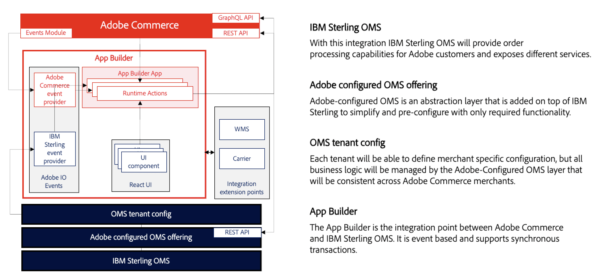

# [!DNL Adobe Commerce Order Management powered by IBM Sterling] Technical overview
>[!NOTE]
>
> Adobe Commerce Order Management powered by IBM Sterling is currently in the Beta Phase; please contact your Sales / CSM contact for more information.

Adobe Commerce Order Management powered by IBM Sterling presents a set of deliverables built and designed for both companies to simplify the integration from both systems with plenty of pre-configuration and pre-defined workflows and an out-of-process integration that handle all the integration between both systems and the 3rd parties required to accomplish a merchant need.

## Adobe configured OMS offering

Adobe and IBM defined an OMS pre-defined layer for all Adobe merchants what delivers a defined set of use cases & pre-configuration, which reduces the integration complexity and allows customers to get started with OMS for Commerce in 8 weeks.
The layer also exposes all the required APIs and events for the App Builder application and is able to integrate both systems and empower solution partners to build all the integration needed in the App Builder application.

## App Builder

[!DNL Adobe Commerce Order Management powered by IBM Sterling] centralize the extensibility mechanism in an App Builder application. This means that a system integration managing an integration will be able to realize all the required connections between the systems (Adobe/IBM) and outside (ERP, WMS, etc) from a single point that is decoupled from Adobe Commerce & IBM Sterling and with the same technology stack. That extensibility approach will reduce TCO as SIs will be able to release changes without requiring changes for Adobe Commerce and/or IBM Sterling.
As part of the deliverables, we will provide the SI with a template that will cover most of the use cases and could be used as a foundational blueprint integration between our systems. Please check the capabilities currently offered [here](capabilities.md).

Current event-based synchronization:
- Stock
- Order / Order flow
- Shipments

React components:
- Stock granularity for PDP
- Buy Online & Pick up in store: availability / add to cart in PDP
- Estimated delivery time in PDP

Sample template for integrate IBM Sterling with:
- Carrier
- DC

Available Webhooks:
- Real time stock check

## PHP Module

The integration will provide also a sample code about the following areas:
- Disable / Remove functionality in Adobe Commerce admin panel
- Integrate the React components inside LUMA based storefront
- Integrate Real time stock check webhook in checkout workflow
